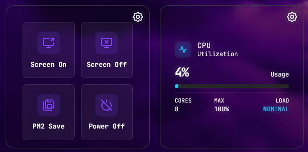

# Corely Action Manager

Corely is a lightweight, local-network web dashboard for executing system bash commands and monitoring hardware.

## Features
- **Action Dashboard**: Execute single or multi-line commands with a click.
- **Drag-to-Sort**: Re-order actions to your preference.
- **Authentication**: Zero-exposure by default; uses local hashed passwords.
- **Widgets System & iFrames**: Fully responsive endpoints (`/cpu`, `/memory`, `/actions`) built specifically to be embedded as iFrames inside external dashboards like **Homarr** or **Homepage**.
- **Granular Customization**: Pick colors globally or customize specific widget overlays.

## Preview


## Installation (Linux)
You can deploy Corely on any standard Linux terminal that has Node.js installed. Download or clone this repository, open the folder in your terminal, and run:
```bash
sudo bash install.sh
```

### CLI Commands
Once installed, Corely runs seamlessly in the background as a `systemd` service and will automatically boot when your server restarts. 
You can use the following commands anywhere:
- `corely start`: Starts the service.
- `corely stop`: Halts the service.
- `corely status`: Shows if the service is running running and if auto-startup is enabled.
- `corely restart`: Restarts the service.
- `corely enable`: Turns ON automatic start on server reboot.
- `corely disable`: Turns OFF automatic start on server reboot.
- `corely reset`: Deletes auth logic, allowing a fresh Admin creation.
- `corely uninstall`: Permanently removes the service from your system.

## Network Access
Upon starting, the server is available on **port 1913**. Navigate to it on any device via `http://YOUR_SERVER_IP:1913` and you'll be greeted with the first-time setup page.

## Credits
This project, its aesthetics, and its iframe widget architecture are heavily inspired by and credit the excellent work of **lxBlazarxl** in the repository [System-Monitor-iFrame-Widget-for-Homarr](https://github.com/lxBlazarxl/System-Monitor-iFrame-Widget-for-Homarr). The widgets are optimized to look fantastic within Homarr grids.
